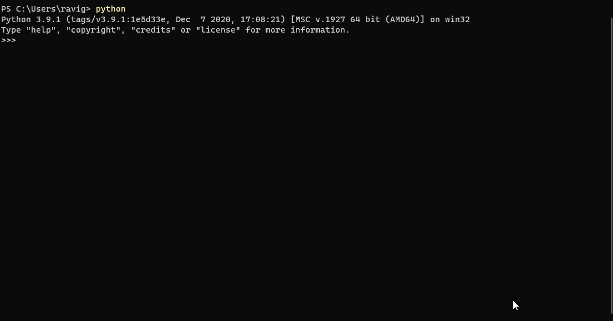
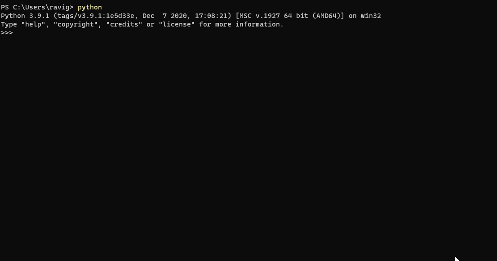
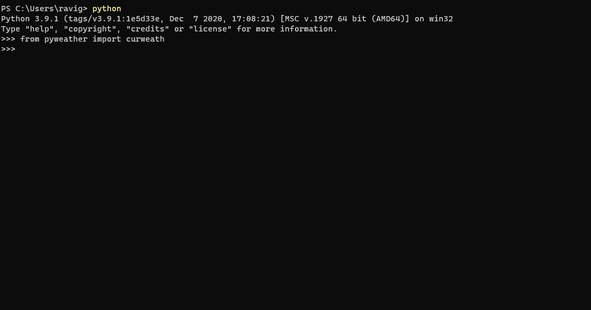

<!-- PROJECT SHIELDS -->
<!--
*** I'm using markdown "reference style" links for readability.
*** Reference links are enclosed in brackets [ ] instead of parentheses ( ).
*** See the bottom of this document for the declaration of the reference variables
*** for contributors-url, forks-url, etc. This is an optional, concise syntax you may use.
*** https://www.markdownguide.org/basic-syntax/#reference-style-links
-->
[![Contributors][contributors-shield]][contributors-url]
[![Forks][forks-shield]][forks-url]
[![Stargazers][stars-shield]][stars-url]
[![Issues][issues-shield]][issues-url]
[![LinkedIn][linkedin-shield]][linkedin-url]


<!-- PROJECT LOGO -->
<br />
<p align="center">
    
  
  <h3 align="center">py-open-weather</h3>
  
  <p align="center">
    A python3 library providing information of Current & Forecast of Weather as well as Air Pollution based on data from OpenWeatherMap.
    <br />
    <a href="https://github.com/ravigoel08/py-open-weather"><strong>Explore the docs »</strong></a>
    <br />
    <br />
    <a href="https://github.com/ravigoel08/py-open-weather/blob/master/assets/">View Demo</a>
    ·
    <a href="https://github.com/ravigoel08/py-open-weather/issues">Report Bug</a>
  </p>
</p>


<!-- TABLE OF CONTENTS -->
<details open="open">
  <summary>Table of Contents</summary>
  <ol>
    <li>
      <a href="#about-the-package">About The Library</a>
      <ul>
        <li><a href="#built-with">Built With</a></li>
      </ul>
    </li>
    <li>
      <a href="#getting-started">Getting Started</a>
      <ul>
        <li><a href="#prerequisites">Prerequisites</a></li>
        <li><a href="#installation">Installation</a></li>
      </ul>
    </li>
    <li><a href="#usage">Usage</a></li>
    <li><a href="#license">License</a></li>
    <li><a href="#contact">Contact</a></li>
  </ol>
</details>


<!-- ABOUT THE PROJECT -->
## About The Library


A python3 library providing information of Current & Forecast of Weather as well as Air Pollution based on data from OpenWeatherMap.

### Built With 

* [Requests](https://requests.readthedocs.io/en/master/)
* [Pydantic](https://pydantic-docs.helpmanual.io/)
* [orjson](https://pypi.org/project/orjson/)
* [Python3](https://www.python.org/) :snake:


<!-- GETTING STARTED -->
## Getting Started 


### Prerequisites 

Python3 and Above

### Installation 

1. Install the Library :eyes:
   ```sh
   pip install py-open-weather
   ```


2. And you are done :boom:


<!-- USAGE EXAMPLES -->
## Usage 
* get Api key from OpenWeatherMap and pass it as environment variable
```sh
# for Windows (PowerShell)
>>> $Env:API_KEY='YOUR API KEY'

# for Linux
>>> export API_KEY='YOUR API KEY'
```

* (Current) Air pollution Data based on longitude and latitude 

```sh
>>> from pyweather import airpol
>>> airpol.by_geoc(50,50)
AirpolData(coord={'lon': 50.0, 'lat': 50.0}, list=[ListItem(dt=1609837200, main=Main(aqi=1), components=Components(co=257.02, no=0.27, no2=0.68, o3=55.08, so2=0.54, pm2_5=4.8, pm10=4.86, nh3=0.1))])
>>> airpol.by_geoc(50,50,'forecast')
```


* (Forecast) Air pollution Data based on longitude and latitude 
```sh
>>> from pyweather import airpol
>>> airpol.by_geoc(50,50,'forecast')
```

* Current Weather Data based on cityname
```sh
>>> from pyweather import curweath
>>> curweath.by_cname('delhi')
WeatherData(coord=Coord(lon=77.22, lat=28.67), weather=[WeatherItem(id=701, main='Mist', description='mist', icon='50d')], base='stations', main=Main(temp=292.15, feels_like=293.41, temp_min=292.15, temp_max=292.15, pressure=1016, humidity=93, sea_level=None, grnd_level=None), visibility=1200, wind=Wind(speed=2.1, deg=30, gust=None), clouds=Clouds(all=75), dt=1609836404, sys=Sys(type=1, id=9165, message=None, country='IN', sunrise=1609811084, sunset=1609848469), timezone=19800, id=1273294, name='Delhi', cod=200)
>>> curweath.by_cid(2172797)
```


* Current Weather Data based on city id
```sh
>>> from pyweather import curweath
>>> curweath.by_cid(2172797)
WeatherData(coord=Coord(lon=145.77, lat=-16.92), weather=[WeatherItem(id=521, main='Rain', description='shower rain', icon='09d'), WeatherItem(id=211, main='Thunderstorm', description='thunderstorm', icon='11d')], base='stations', main=Main(temp=299.2, feels_like=305.28, temp_min=299.15, temp_max=299.26, pressure=1003, humidity=94, sea_level=None, grnd_level=None), visibility=6000, wind=Wind(speed=0.5, deg=270, gust=None), clouds=Clouds(all=75), dt=1609836846, sys=Sys(type=1, id=9490, message=None, country='AU', sunrise=1609789743, sunset=1609836896), timezone=36000, id=2172797, name='Cairns', cod=200)
```


* Current Weather Data based on zipcode and country code
```sh
>>> from pyweather import curweath
>>> curweath.by_zcode(110032, 'in')
WeatherData(coord=Coord(lon=77.29, lat=28.69), weather=[WeatherItem(id=701, main='Mist', description='mist', icon='50d')], base='stations', main=Main(temp=292.15, feels_like=293.41, temp_min=292.15, temp_max=292.15, pressure=1016, humidity=93, sea_level=None, grnd_level=None), visibility=1200, wind=Wind(speed=2.1, deg=30, gust=None), clouds=Clouds(all=75), dt=1609836721, sys=Sys(type=1, id=9165, message=None, country='IN', sunrise=1609811070, sunset=1609848450), timezone=19800, id=0, name='Babarpur (North East Delhi)', cod=200)
```


* Current Weather Data based on Longitude and Latitude
```sh
>>> from pyweather import curweath
>>> curweath.by_geoc(50,50)
WeatherData(coord=Coord(lon=50.0, lat=50.0), weather=[WeatherItem(id=804, main='Clouds', description='overcast clouds', icon='04d')], base='stations', main=Main(temp=262.97, feels_like=256.76, temp_min=262.97, temp_max=262.97, pressure=1042, humidity=93, sea_level=1042, grnd_level=1041), visibility=10000, wind=Wind(speed=4.4, deg=132, gust=None), clouds=Clouds(all=99), dt=1609836784, sys=Sys(type=None, id=None, message=None, country='KZ', sunrise=1609821467, sunset=1609851156), timezone=18000, id=607847, name='West Kazakhstan', cod=200)
```


<!-- LICENSE -->
## License 

Distributed under the MIT License. See `LICENSE` for more information.


<!-- CONTACT -->
## Contact

CodewithRv - ravigoel.1997@gmail.com

Project Link: [https://github.com/ravigoel08/py-open-weather](https://github.com/ravigoel08/py-open-weather)


<!-- MARKDOWN LINKS & IMAGES -->
<!-- https://www.markdownguide.org/basic-syntax/#reference-style-links -->


[contributors-url]: https://github.com/ravigoel08/py-open-weather/graphs/contributors
[forks-url]: https://github.com/ravigoel08/py-open-weather/network/members
[stars-url]: https://github.com/ravigoel08/py-open-weather/stargazers
[issues-url]: https://github.com/ravigoel08/py-open-weather/issues
[linkedin-url]: https://www.linkedin.com/in/ravi-goyal52/
[contributors-shield]: https://img.shields.io/github/contributors/ravigoel08/py-open-weather?style=for-the-badge
[issues-shield]: https://img.shields.io/github/issues/ravigoel08/py-open-weather?style=for-the-badge
[forks-shield]: https://img.shields.io/github/forks/ravigoel08/py-open-weather?style=for-the-badge
[stars-shield]: https://img.shields.io/github/stars/ravigoel08/py-open-weather?style=for-the-badge
[linkedin-shield]: https://img.shields.io/badge/-LinkedIn-black.svg?style=for-the-badge&logo=linkedin&colorB=555
